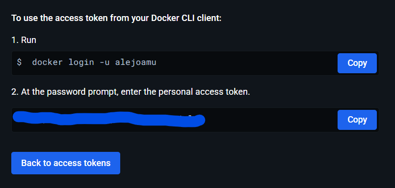
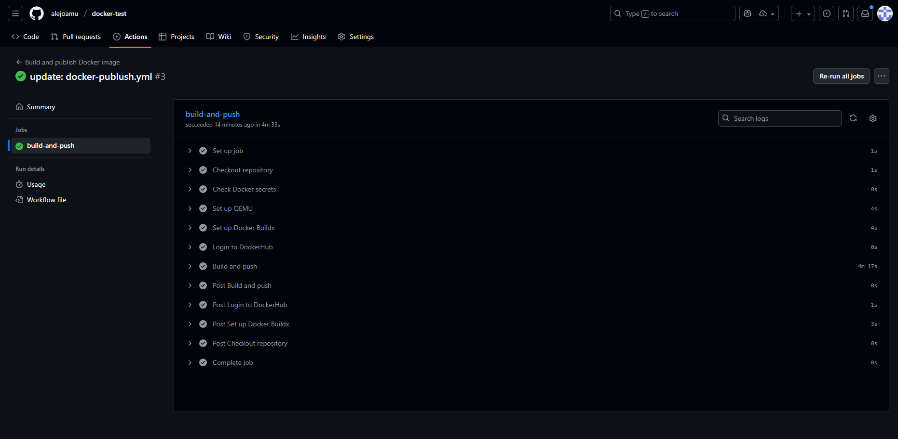
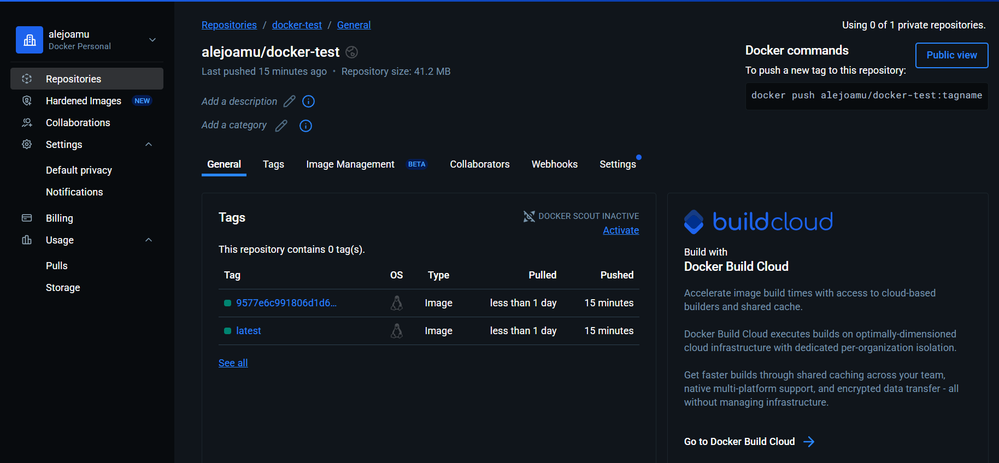
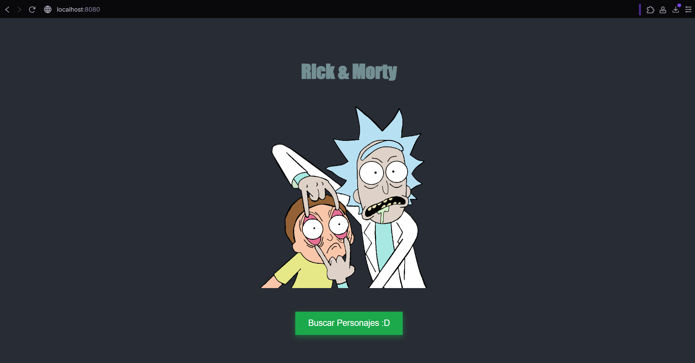

# 🐳 Taller Docker Test - Rick & Morty App
Autor: alejoamu

## 📋 Descripción del Proyecto
Aplicación web desarrollada con Create React App que muestra personajes de Rick & Morty. En este repositorio se añadió:

- Un `Dockerfile` multi-stage para construir la app y servirla con `nginx` en producción.
- Un workflow de GitHub Actions para construir y publicar la imagen Docker en Docker Hub: `.github/workflows/docker-publish.yml`.
- Un `.dockerignore` para excluir archivos que no deben incluirse en la imagen.

El objetivo es demostrar contenedorización y CI/CD automático usando GitHub Actions y Docker Hub.

## 🚀 Guía de Ejecución Paso a Paso

### Prerrequisitos
- Docker instalado
- Node.js 18+ (solo para desarrollo local)
- Cuenta en Docker Hub
- Repositorio en GitHub con los secrets configurados

### 📝 Paso 1: Dockerfile (qué hace)
El `Dockerfile` usado en este proyecto es multi-stage:

- Etapa `build` (base: `node:18-alpine`): instala dependencias y ejecuta `npm run build`.
- Etapa `production` (base: `nginx:stable-alpine`): copia la carpeta `build` a `/usr/share/nginx/html` y sirve la app en el puerto 80.

Esto produce una imagen optimizada para producción que solo contiene los artefactos estáticos y `nginx`.

#### Configuración del `Dockerfile`
Aquí tienes el `Dockerfile` utilizado en este repositorio (multi-stage) — puedes copiarlo a la raíz como `Dockerfile`:

```dockerfile
# Multi-stage Dockerfile for Create React App
FROM node:18-alpine AS build
WORKDIR /app
COPY package*.json ./
RUN npm ci --silent
COPY . .
RUN npm run build

FROM nginx:stable-alpine AS production
RUN rm -rf /usr/share/nginx/html/*
COPY --from=build /app/build /usr/share/nginx/html
EXPOSE 80
CMD ["nginx", "-g", "daemon off;"]
```

Explicación rápida de cada línea relevante:
- `node:18-alpine`: pequeña imagen para compilar la app.
- `npm ci --silent`: instala dependencias reproducibles en CI.
- `npm run build`: genera los archivos estáticos en `build/`.
- `nginx:stable-alpine`: imagen ligera para servir contenido estático.
- `COPY --from=build /app/build /usr/share/nginx/html`: copia artefactos al servidor web.

### ⚙️ Paso 2: GitHub Actions (CI/CD)
Archivo: `.github/workflows/docker-publish.yml`

Resumen del workflow:

- Checkout del repositorio
- Setup QEMU y Docker Buildx (para build multi-arch)
- Login a Docker Hub usando secrets
- Build y push de la imagen (tags: `latest` y `sha`)

Tags que se generan:
- `${{ secrets.DOCKERHUB_USERNAME }}/docker-test:latest`
- `${{ secrets.DOCKERHUB_USERNAME }}/docker-test:${{ github.sha }}`

### 🔑 Paso 3: Configurar secretos en GitHub
Ve a: Repository → Settings → Secrets and variables → Actions → New repository secret

Agrega estos secrets:

- `DOCKERHUB_USERNAME` — tu usuario de Docker Hub (ej. `alejoamu`)
- `DOCKERHUB_TOKEN` — Personal Access Token generado en Docker Hub (Account → Personal Access Tokens → Create)



El workflow comprueba que ambos secretos existan antes de intentar el login.


#### Configuración del workflow (ejemplo)
Este es el contenido principal del workflow que se agregó al repo — puedes revisarlo en `.github/workflows/docker-publish.yml`:

```yaml
name: Build and publish Docker image

on:
	push:
		branches: [ main ]
	workflow_dispatch:

jobs:
	build-and-push:
		runs-on: ubuntu-latest
		steps:
			- uses: actions/checkout@v4
			- uses: docker/setup-qemu-action@v2
			- uses: docker/setup-buildx-action@v2
			- name: Check Docker secrets
				run: |
					if [ -z "${{ secrets.DOCKERHUB_USERNAME }}" ] || [ -z "${{ secrets.DOCKERHUB_TOKEN }}" ]; then
						echo "::error::DOCKERHUB_USERNAME or DOCKERHUB_TOKEN is not set"; exit 1
					fi
			- uses: docker/login-action@v2
				with:
					registry: docker.io
					username: ${{ secrets.DOCKERHUB_USERNAME }}
					password: ${{ secrets.DOCKERHUB_TOKEN }}
			- uses: docker/build-push-action@v5
				with:
					context: .
					file: ./Dockerfile
					push: true
					tags: |
						${{ secrets.DOCKERHUB_USERNAME }}/docker-test:latest
						${{ secrets.DOCKERHUB_USERNAME }}/docker-test:${{ github.sha }}
```

### ✅ Paso 4: Ejecutar el pipeline (trigger)
El workflow se ejecuta automáticamente al hacer `push` en `main`. También puedes ejecutarlo manualmente desde la interfaz de Actions (`Run workflow`) o lanzar un commit vacío:

```powershell
cd D:\docker-test
git commit --allow-empty -m "Trigger CI: build and push image"
git push origin main
```


## 📦 Verificar la imagen en Docker Hub
Después de un push exitoso, la imagen debe aparecer en Docker Hub bajo tu cuenta, repo `docker-test`.



Puedes verificar tirando la imagen desde cualquier máquina:

```powershell
# Reemplaza <TU_USUARIO> por tu usuario en Docker Hub
docker pull <TU_USUARIO>/docker-test:latest
docker run --rm -p 8080:80 <TU_USUARIO>/docker-test:latest
# Abrir http://localhost:8080
```

Nota: la imagen sirve la app en el puerto 80 dentro del contenedor; localmente mapeamos a `8080` para evitar conflictos.

Una vez ejecutado el contenedor, la aplicación estará disponible en:

URL: http://localhost:8080



## 🖥️ Ejecutar localmente (sin Docker Hub)
Puedes construir y correr la imagen localmente para probar:

```powershell
cd D:\docker-test
docker build -t docker-test:local .
docker run --rm -p 8080:80 docker-test:local
# Abrir http://localhost:8080
```

Si prefieres ejecutar la app en modo desarrollo con Node:

```powershell
npm install
npm run dev
# o npm start según tu package.json
```

## 🔍 Logs y debugging
- Si el workflow falla en el paso de login, verifica los secrets (`DOCKERHUB_USERNAME` y `DOCKERHUB_TOKEN`).
- Si falla `npm run build` en el runner, revisa los logs del step `Build and push` para detalles de compilación.
- Para problemas con `docker buildx` o QEMU, revisa los pasos `Set up QEMU` y `Set up Docker Buildx` en los logs.

